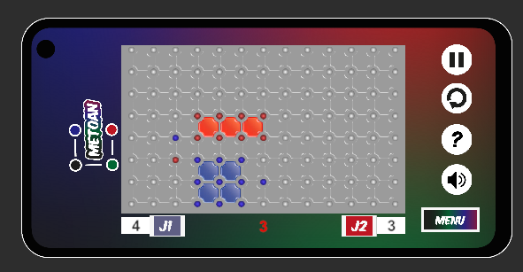
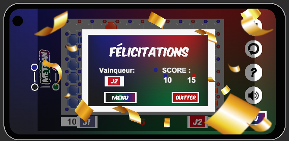

# Metoan

Bienvenue dans Metoan, un jeu de réflexion mobile créé dans le cadre de la BiGJam. Actuellement, seule la fonctionnalité de jeu en mode deux joueurs sur un même téléphone est implémentée. Lisez ce guide pour comprendre les règles du jeu et comment démarrer.

## Description

Metoan est un jeu de réflexion à un contre un se déroulant sur un terrain de jeu similaire à une page de papier cahier, avec des carreaux. Le but est de créer le plus grand nombre de cases en plaçant des points aux extrémités de ces carreaux. Chaque fois qu'un joueur réussit à placer des points sur toutes les extrémités d'un carreau, il remporte 1 point. Cependant, l'adversaire suit les mêmes règles et peut bloquer vos mouvements en plaçant ses propres points intelligemment. La stratégie est cruciale, car vous devez à la fois maximiser vos gains et empêcher votre adversaire de le faire.

De plus, le temps joue un rôle crucial. Chaque joueur dispose d'un délai très court pour effectuer son coup. Si vous ne parvenez pas à jouer dans le temps imparti, l'adversaire prendra le relais, et vous ne pourrez plus agir lors de ce tour.

## Configuration de développement

Ce projet a été développé avec Unity 2023.35f. Assurez-vous d'utiliser cette version ou une version ultérieure pour une compatibilité optimale.

## Fonctionnalités (actuelles et futures)

- [x] Mode deux joueurs sur un même téléphone (implémenté)
- [ ] Mode multijoueur en ligne
- [ ] Différents niveaux de difficulté
- [ ] Personnalisation du terrain de jeu
- [ ] Statistiques de jeu
- [ ] ...

## Comment jouer

1. Téléchargez et installez l'application Metoan sur votre appareil mobile.
2. Lancez l'application et sélectionnez le mode deux joueurs.
3. Jouez à tour de rôle en plaçant des points aux extrémités des carreaux.
4. Gagnez des points en complétant des cases, mais méfiez-vous des mouvements de votre adversaire.
5. Assurez-vous de jouer dans le délai imparti pour éviter que votre adversaire ne prenne le relais.

## Captures d'écran

*Deroulement d'une partie*

*Image de félicitaion*

